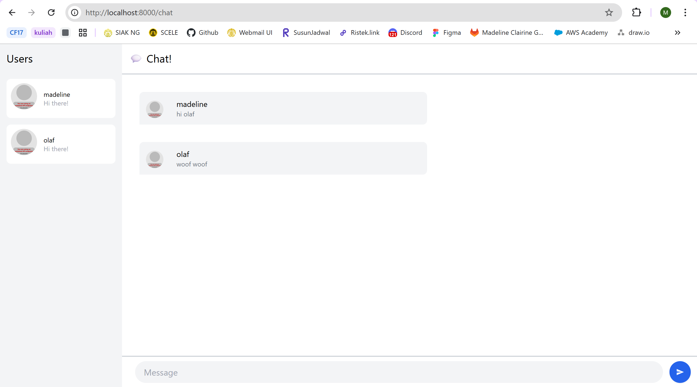
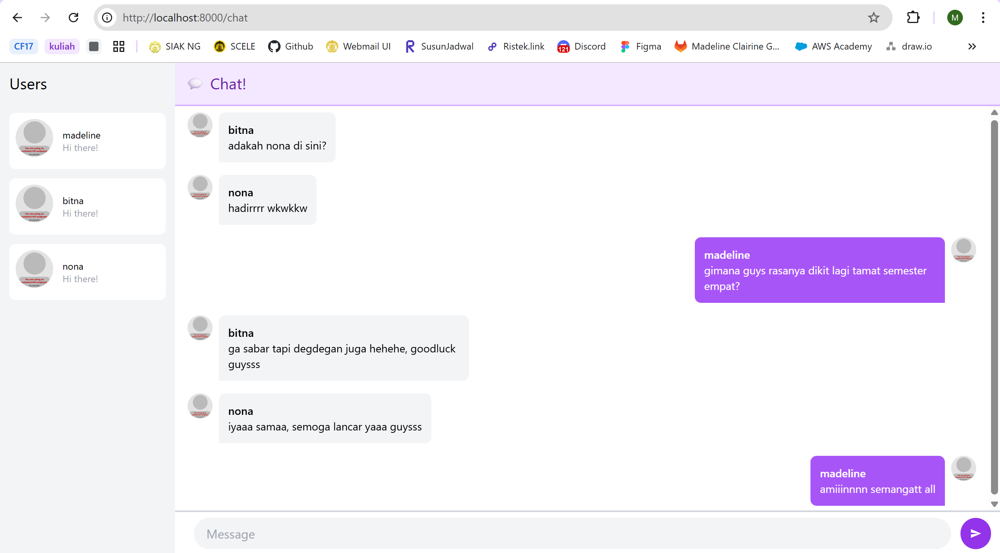

# Tutorial 10 Pemrograman Lanjut: Web Chat
### Madeline Clairine Gultom - 2306207846 - ADPRO A

## Original Code
Saya mencoba untuk menjalani Websocket dan Yewchat dengan command `npm start`. Kemudian, akan muncul halaman untuk memasukkan username dan tombol untuk memulai percakapan. Di sini, saya mencoba untuk membuka dua tab di awal agar terdapat lebih dari satu user yang melakukan percakapan.

## Add Some Creativities to the Webclient
Saya mencoba untuk mengubah tampilan halaman agar memiliki nuansa berwarna ungu dan mengubah tata letak bubble chat sesuai sudut pandang user.
